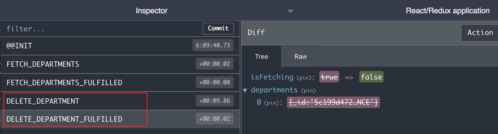

# Redux Async Actions - Delete
- Async actions allows us to keep the RESTful API calls separated from React component. 
  
## Liv Demo
https://async-actions.herokuapp.com/

### 1. Add Middleware
**Added two redux middlewares in creatStore.**
- [Redux thunk](https://github.com/reduxjs/redux-thunk)
  >Redux Thunk middleware allows you to write action creators that return a function instead of an action object.
- [Redux logger](https://github.com/LogRocket/redux-logger)


```js
import { createStore, applyMiddleware} from "redux";
import { createLogger } from 'redux-logger'
import thunk from "redux-thunk";
import departmentsReducer from '../reducers/departments';

const middleware = applyMiddleware(thunk, createLogger()); 
export default () => {
  const store = createStore(departmentsReducer, middleware);
  return store;
};
```

### 2. Async Actions - returns a function!
- In `deleteDepartment()`, a function returns instead action.

```js
export const deleteDepartment = (id) => {
  return function(dispatch) { //A function returns! 
    dispatch({type: "DELETE_DEPARTMENT"});
    axios.delete(`/api/departments/${id}`)
      .then((response) => {
        dispatch({type: "DELETE_DEPARTMENT_FULFILLED", payload: response.data})
      })
      .catch((err) => {
        dispatch({type: "DELETE_DEPARTMENT_REJECTED", payload: err})
      })
  }
}
```

## 3. Reducer
JavaScript promise has three status 1) Pending, 2) Fulfilled, 3) Rejected and Reducer has to have three types to related Promise status.

- DELETE_DEPARTMENT
- DELETE_DEPARTMENT_**REJECTED**
- DELETE_DEPARTMENT_**FULFILLED**

```js
const departmentsDefaultState = {
  isFetching: false,
  error: null,
  departments: []
};

const departmentsReducer = (state=departmentsDefaultState, action) => {
  switch (action.type) {
    case "DELETE_DEPARTMENT": {
      return {...state, isFetching: true}
    }
    case "DELETE_DEPARTMENT_REJECTED": {
      return {...state, isFetching: false, error: action.payload}
    }
    case "DELETE_DEPARTMENT_FULFILLED": {
      console.log('DELETE_DEPARTMENT_FULFILLED');
      const updateDepartments = state.departments.filter(({ _id }) => _id !== action.payload._id);
      console.log(updateDepartments);
      return {
        ...state,
        isFetching: false,
        departments: updateDepartments
      }
    }
  }
  return state
}
export default departmentsReducer;
```

## 4. Access Redux store(info) in React component!
Here is the step to access Redux store into React component.

1. Convert a regular component to **a connected component**. A connected component becomes to access Redux infomation.
2. Defines `mapToState` function and select you want to access the data. In this case "departments".
3. Import deleteDepartment function from action/departments.js
  ```js
  import {deleteDepartment} from '../actions/departments';
  ```
4. Add delete button.
5. Add dispatch() in onClick.
   
```js
<button onClick={()=>{ 
   this.props.dispatch(deleteDepartment(department._id)); 
 }}>
```

**Here is the entire code!**

```js
import React, {Component} from 'react';
import { connect } from 'react-redux';
// 3. Import deleteDepartment function from action file.
import {fetchDepartments, deleteDepartment} from '../actions/departments';

class DepartmentListPage extends Component{
  constructor(props){
    super(props);
  }
  componentDidMount(){
    this.props.dispatch( fetchDepartments() );
  }
  render() {
      return (
        <div>
          <ul>
            {
              this.props.departments.map((department) =>
                <li key={department._id}>
                    {department.name}
                    <button
                      onClick={()=>{ 
                        this.props.dispatch(deleteDepartment(department._id)); 
                        this.props.history.push('/');
                      }}>
                    Delete
                    </button>
                </li>
              )
            }
          </ul>                
        </div>
      ) 
  }  
};
// 2. Select which data you want to access from Redux. 
const mapStateToProps = (state) => {
  return {
    departments: state.departments
  };
};
// 1. Convert regular component to connected component. 
export default connect(mapStateToProps)(DepartmentListPage);
```

## Screenshot



## References:
- [Redux Async Actions](https://redux.js.org/advanced/async-actions)
- [Connect: Extracting Data with mapStateToProps](https://react-redux.js.org/using-react-redux/connect-mapstate)
