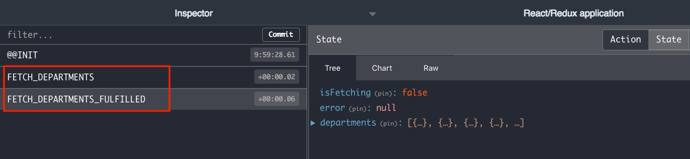
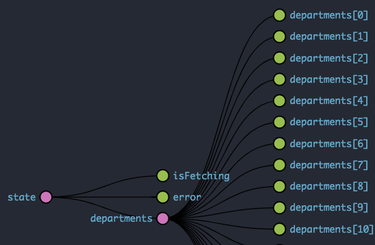

# Redux Async Actions - Read
- Async actions allows us to keep the RESTful API calls separated from React component. 
  
## Liv Demo
https://async-actions.herokuapp.com/

### 1. Add Middleware
**Added two redux middlewares in creatStore.**
- [Redux thunk](https://github.com/reduxjs/redux-thunk)
  >Redux Thunk middleware allows you to write action creators that return a function instead of an action object.
- [Redux logger](https://github.com/LogRocket/redux-logger)


```js
import { createStore, applyMiddleware} from "redux";
import { createLogger } from 'redux-logger'
import thunk from "redux-thunk";
import departmentsReducer from '../reducers/departments';

const middleware = applyMiddleware(thunk, createLogger()); 
export default () => {
  const store = createStore(departmentsReducer, middleware);
  return store;
};
```

### 2. Async Actions - returns a function!
- In `fetchDepartment()`, a function returns instead action object.
- URL for axios:  https://afternoon-thicket-91110.herokuapp.com/api/departments
```js
import axios from "axios";

export const fetchDepartments = () => {
  return function(dispatch) {
    dispatch({type: "FETCH_DEPARTMENTS"});
    axios.get("/api/departments")
      .then((response) => {
        dispatch({type: "FETCH_DEPARTMENTS_FULFILLED", payload: response.data})
      })
      .catch((err) => {
        dispatch({type: "FETCH_DEPARTMENTS_REJECTED", payload: err})
      })
  }
}
```

## 3. Reducer
JavaScript promise has three status 1) Pending, 2) Fulfilled, 3) Rejected and Reducer has to have three types to related Promise status.

- FETCH_DEPARTMENTS
- FETCH_DEPARTMENTS_**REJECTED**
- FETCH_DEPARTMENTS_**FULFILLED**

```js
const departmentsDefaultState = {
  isFetching: false,
  error: null,
  departments: []
};

const departmentsReducer = (state=departmentsDefaultState, action) => {
  switch (action.type) {
    case "FETCH_DEPARTMENTS": {
      return {...state, isFetching: true}
    }
    case "FETCH_DEPARTMENTS_REJECTED": {
      return {...state, isFetching: false, error: action.payload}
    }
    case "FETCH_DEPARTMENTS_FULFILLED": {
      return {
        ...state,
        isFetching: false,
        departments: action.payload, // saved departments!
      }
    }
  }
  return state
}
export default departmentsReducer;
```

## 4. Connected component instead of regular component
- Convert regular React component to **connected component** so that React component can access Redux store.
 
```js
import { connect } from 'react-redux';

class DepartmentListPage extends Component{}

export default connect(mapStateToProps)(DepartmentListPage); // Set component name in second parameter
```

## 5. MapToState 
- You can select the data from redux store using `mapToState` function!

```js
const mapStateToProps = (state) => {
  return {
    departments: state.departments,
  };
};
export default connect(mapStateToProps)(DepartmentListPage);
```

## 6. `dispatch` async action

```js
class DepartmentListPage extends Component{
  constructor(props){
    super(props);
  }
  componentDidMount(){
    this.props.dispatch( fetchDepartments() );  // dispatch async action!!!
  }
  ...
}  
```

## Screenshot



## References:
- [Redux Async Actions](https://redux.js.org/advanced/async-actions)
- [Connect: Extracting Data with mapStateToProps](https://react-redux.js.org/using-react-redux/connect-mapstate)
